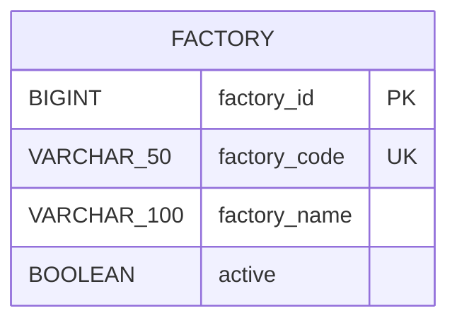

# ERD

## 1. Factory

### 제약조건

| 이름 | 대상 | 설명 |
| --- | --- | --- |
| `pk_factory` | `factory_id` | 공장 내부 식별자 |
| `uk_factory_code` | `factory_code` | 정규화된 공장 코드 중복 방지 |
| `ck_factory_code_format` | `factory_code` | 공장 코드 허용 문자와 길이 검증 |
| `ck_factory_name_not_blank` | `factory_name` | 공백으로만 구성된 이름 방지 |

애플리케이션 도메인 검증은 빠른 실패와 명확한 메시지를 담당하고, 데이터베이스 제약조건은 우회 입력과 동시 요청에서도 무결성을 보장합니다.

