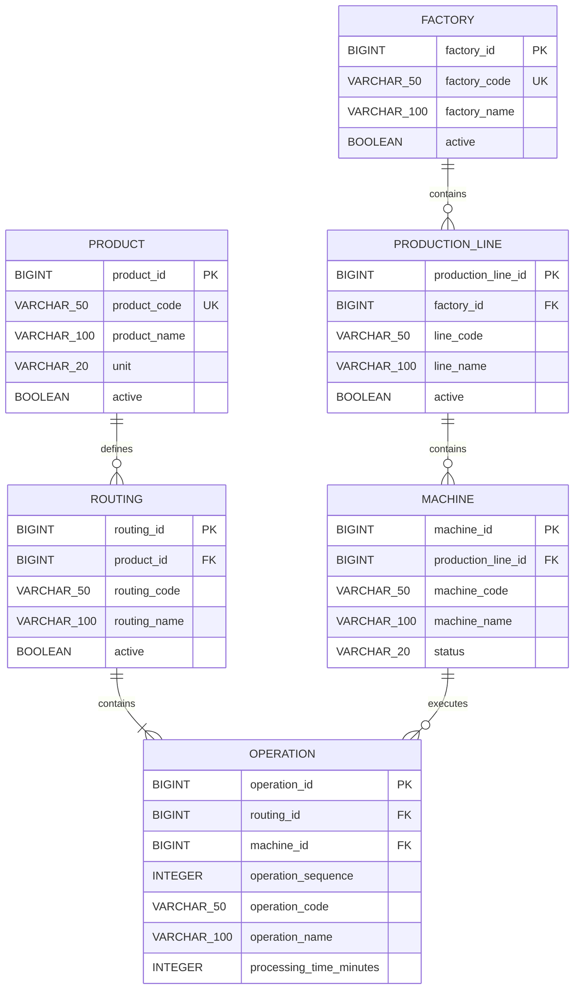

# ERD

## 1. Factory

### 제약조건

| 이름 | 대상 | 설명 |
| --- | --- | --- |
| `pk_factory` | `factory_id` | 공장 내부 식별자 |
| `uk_factory_code` | `factory_code` | 정규화된 공장 코드 중복 방지 |
| `ck_factory_code_format` | `factory_code` | 공장 코드 허용 문자와 길이 검증 |
| `ck_factory_name_not_blank` | `factory_name` | 공백으로만 구성된 이름 방지 |

애플리케이션 도메인 검증은 빠른 실패와 명확한 메시지를 담당하고, 데이터베이스 제약조건은 우회 입력과 동시 요청에서도 무결성을 보장합니다.

### ProductionLine 제약조건

| 이름 | 대상 | 설명 |
| --- | --- | --- |
| `pk_production_line` | `production_line_id` | 생산라인 내부 식별자 |
| `fk_production_line_factory` | `factory_id` | 소속 Factory 참조 |
| `uk_production_line_factory_code` | `factory_id`, `line_code` | 공장 내 라인 코드 중복 방지 |
| `ck_production_line_code_format` | `line_code` | 라인 코드 형식 검증 |
| `ck_production_line_name_not_blank` | `line_name` | 공백 이름 방지 |
| `ix_production_line_factory_id` | `factory_id` | 공장별 라인 접근을 위한 인덱스 |

### Machine 제약조건

| 이름 | 대상 | 설명 |
| --- | --- | --- |
| `pk_machine` | `machine_id` | 설비 내부 식별자 |
| `fk_machine_production_line` | `production_line_id` | 소속 생산라인 참조 |
| `uk_machine_line_code` | `production_line_id`, `machine_code` | 라인 내 설비 코드 중복 방지 |
| `ck_machine_code_format` | `machine_code` | 설비 코드 형식 검증 |
| `ck_machine_name_not_blank` | `machine_name` | 공백 이름 방지 |
| `ck_machine_status` | `status` | 정의된 MachineStatus만 허용 |
| `ix_machine_production_line_id` | `production_line_id` | 라인별 설비 접근 인덱스 |

### Product 제약조건

| 이름 | 대상 | 설명 |
| --- | --- | --- |
| `pk_product` | `product_id` | 품목 내부 식별자 |
| `uk_product_code` | `product_code` | 정규화된 품목 코드 중복 방지 |
| `ck_product_code_format` | `product_code` | 품목 코드 형식 검증 |
| `ck_product_name_not_blank` | `product_name` | 공백 이름 방지 |
| `ck_product_unit` | `unit` | 정의된 ProductUnit만 허용 |

### Routing과 Operation 제약조건

| 이름 | 대상 | 설명 |
| --- | --- | --- |
| `uk_routing_product_code` | `product_id`, `routing_code` | 품목별 Routing 코드 중복 방지 |
| `uk_operation_routing_sequence` | `routing_id`, `operation_sequence` | Routing 내 공정 순서 중복 방지 |
| `uk_operation_routing_code` | `routing_id`, `operation_code` | Routing 내 공정 코드 중복 방지 |
| `ck_operation_processing_time` | `processing_time_minutes` | 1~10080분 범위 보장 |
| `ix_operation_machine_id` | `machine_id` | 설비별 Operation 접근 인덱스 |
