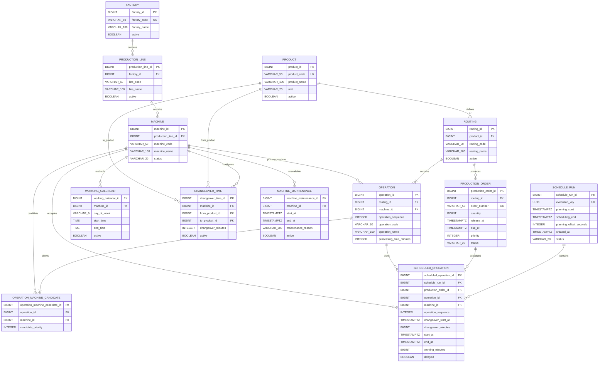

# ERD

## 1. Current Schema

현재 스키마 기준은 Flyway `V14__create_operation_machine_candidate_table.sql`입니다.
JPA는 `ddl-auto=validate`로 아래 테이블과 매핑의 일치 여부만 검증합니다.

### 제약조건

| 이름 | 대상 | 설명 |
| --- | --- | --- |
| `pk_factory` | `factory_id` | 공장 내부 식별자 |
| `uk_factory_code` | `factory_code` | 정규화된 공장 코드 중복 방지 |
| `ck_factory_code_format` | `factory_code` | 공장 코드 허용 문자와 길이 검증 |
| `ck_factory_name_not_blank` | `factory_name` | 공백으로만 구성된 이름 방지 |

애플리케이션 도메인 검증은 빠른 실패와 명확한 메시지를 담당하고, 데이터베이스 제약조건은 우회 입력과 동시 요청에서도 무결성을 보장합니다.

### ProductionLine 제약조건

| 이름 | 대상 | 설명 |
| --- | --- | --- |
| `pk_production_line` | `production_line_id` | 생산라인 내부 식별자 |
| `fk_production_line_factory` | `factory_id` | 소속 Factory 참조 |
| `uk_production_line_factory_code` | `factory_id`, `line_code` | 공장 내 라인 코드 중복 방지 |
| `ck_production_line_code_format` | `line_code` | 라인 코드 형식 검증 |
| `ck_production_line_name_not_blank` | `line_name` | 공백 이름 방지 |
| `ix_production_line_factory_id` | `factory_id` | 공장별 라인 접근을 위한 인덱스 |

### Machine 제약조건

| 이름 | 대상 | 설명 |
| --- | --- | --- |
| `pk_machine` | `machine_id` | 설비 내부 식별자 |
| `fk_machine_production_line` | `production_line_id` | 소속 생산라인 참조 |
| `uk_machine_line_code` | `production_line_id`, `machine_code` | 라인 내 설비 코드 중복 방지 |
| `ck_machine_code_format` | `machine_code` | 설비 코드 형식 검증 |
| `ck_machine_name_not_blank` | `machine_name` | 공백 이름 방지 |
| `ck_machine_status` | `status` | 정의된 MachineStatus만 허용 |
| `ix_machine_production_line_id` | `production_line_id` | 라인별 설비 접근 인덱스 |

### Product 제약조건

| 이름 | 대상 | 설명 |
| --- | --- | --- |
| `pk_product` | `product_id` | 품목 내부 식별자 |
| `uk_product_code` | `product_code` | 정규화된 품목 코드 중복 방지 |
| `ck_product_code_format` | `product_code` | 품목 코드 형식 검증 |
| `ck_product_name_not_blank` | `product_name` | 공백 이름 방지 |
| `ck_product_unit` | `unit` | 정의된 ProductUnit만 허용 |

### Routing과 Operation 제약조건

| 이름 | 대상 | 설명 |
| --- | --- | --- |
| `uk_routing_product_code` | `product_id`, `routing_code` | 품목별 Routing 코드 중복 방지 |
| `uk_operation_routing_sequence` | `routing_id`, `operation_sequence` | Routing 내 공정 순서 중복 방지 |
| `uk_operation_routing_code` | `routing_id`, `operation_code` | Routing 내 공정 코드 중복 방지 |
| `ck_operation_processing_time` | `processing_time_minutes` | 1~10080분 범위 보장 |
| `ix_operation_machine_id` | `machine_id` | 설비별 Operation 접근 인덱스 |
| `uk_operation_machine_candidate` | `operation_id`, `machine_id` | 같은 설비의 후보 중복 방지 |
| `ck_operation_machine_candidate_priority` | `candidate_priority` | 후보 우선순위를 1~1000으로 제한 |
| `ix_operation_machine_candidate_operation_priority` | 공정·우선순위·후보 ID | 공정별 후보 조회 순서 지원 |
| `ix_operation_machine_candidate_machine_id` | `machine_id` | 설비별 후보 정의 접근 지원 |

`V14`는 기존 `operation.machine_id`를 각 공정의 우선순위 1 후보로 백필합니다. 주 설비 FK는
041 이전 스케줄러와 기존 API 계약을 위해 유지합니다.

### ProductionOrder 제약조건

| 이름 | 대상 | 설명 |
| --- | --- | --- |
| `uk_production_order_number` | `order_number` | 생산오더 번호 중복 방지 |
| `ck_production_order_quantity` | `quantity` | 1~1,000,000 수량 범위 |
| `ck_production_order_dates` | `release_at`, `due_at` | 납기가 투입 가능 시각 이후임을 보장 |
| `ck_production_order_priority` | `priority` | 1~100 우선순위 범위 |
| `ix_production_order_status_due` | `status`, `due_at` | 스케줄 대상 오더 조회 지원 |

### WorkingCalendar 제약조건

| 이름 | 대상 | 설명 |
| --- | --- | --- |
| `uk_working_calendar_machine_window` | 설비·요일·시작·종료 | 동일 근무 구간 중복 방지 |
| `ck_working_calendar_day` | `day_of_week` | 유효한 요일만 허용 |
| `ck_working_calendar_time` | `start_time`, `end_time` | 종료가 시작보다 이후임을 보장 |
| `ix_working_calendar_machine_day` | 설비·요일·시작 | 설비 주간 캘린더 조회 지원 |

### ScheduleRun과 ScheduledOperation 제약조건

| 이름 | 대상 | 설명 |
| --- | --- | --- |
| `uk_schedule_run_execution_key` | `execution_key` | 같은 실행 요청의 중복 저장 방지 |
| `ck_schedule_run_period` | 계획 시작·스케줄 종료 | 종료가 계획 시작보다 이전이 아님을 보장 |
| `ck_schedule_run_planning_offset` | `planning_offset_seconds` | UTC offset을 ±18시간 범위로 제한 |
| `uk_scheduled_operation_run_order_operation` | 실행·오더·공정 | 한 실행에서 같은 오더 공정 중복 방지 |
| `ck_scheduled_operation_period` | 시작·종료 | 작업 종료가 시작보다 이후임을 보장 |
| `ck_scheduled_operation_changeover_minutes` | `changeover_minutes` | Changeover Time이 0분 이상임을 보장 |
| `ck_scheduled_operation_changeover_period` | 전환 시작·가공 시작 | 전환이 있으면 시작시각이 가공 시작보다 이전임을 보장 |
| `ix_scheduled_operation_run_start` | 실행·시작 | 간트 보드 시간순 조회 지원 |
| `ix_scheduled_operation_machine_start` | 설비·시작 | 설비별 부하 조회 지원 |

### ChangeoverTime 제약조건

| 이름 | 대상 | 설명 |
| --- | --- | --- |
| `pk_changeover_time` | `changeover_time_id` | 전환시간 내부 식별자 |
| `fk_changeover_time_machine` | `machine_id` | 전환이 발생하는 설비 참조 |
| `fk_changeover_time_from_product` | `from_product_id` | 이전 품목 참조 |
| `fk_changeover_time_to_product` | `to_product_id` | 다음 품목 참조 |
| `uk_changeover_time_machine_products` | 설비·이전 품목·다음 품목 | 방향성 조합 중복 방지 |
| `ck_changeover_time_different_products` | 이전 품목·다음 품목 | 동일 품목 조합 저장 방지 |
| `ck_changeover_time_minutes` | `changeover_minutes` | 0분 이상 보장 |
| `ix_changeover_time_machine_id` | `machine_id` | 설비별 전환시간 조회 지원 |
| `ix_changeover_time_product_pair` | 이전 품목·다음 품목 | 품목 전환 조합 조회 지원 |

### MachineMaintenance 제약조건

| 이름 | 대상 | 설명 |
| --- | --- | --- |
| `pk_machine_maintenance` | `machine_maintenance_id` | 계획 정비 내부 식별자 |
| `fk_machine_maintenance_machine` | `machine_id` | 정비 대상 설비 참조 |
| `ck_machine_maintenance_period` | 시작·종료 | 종료가 시작보다 이후임을 보장 |
| `ck_machine_maintenance_reason_not_blank` | `maintenance_reason` | 공백 사유 저장 방지 |
| `ex_machine_maintenance_no_overlap` | 설비·정비 구간 | PostgreSQL GiST 배제 제약으로 동시 요청의 겹침까지 차단 |
| `ix_machine_maintenance_machine_start` | 설비·시작 | 설비별 정비시간 조회 지원 |
